# Procesverslag
Markdown is een simpele manier om HTML te schrijven.  
Markdown cheat cheet: [Hulp bij het schrijven van Markdown](https://github.com/adam-p/markdown-here/wiki/Markdown-Cheatsheet).

Nb. De standaardstructuur en de spartaanse opmaak van de README.md zijn helemaal prima. Het gaat om de inhoud van je procesverslag. Besteedt de tijd voor pracht en praal aan je website.

Nb. Door *open* toe te voegen aan een *details* element kun je deze standaard open zetten. Fijn om dat steeds voor de relevante stuk(ken) te doen.

## Jij

  
uitwerken voor kick-off werkgroep

  ### Auteur:
  Julia Hoek

  #### Je startniveau:
  Rood

  #### Je focus:
  Responsive
 

## Je website

  
uitwerken voor kick-off werkgroep

  ### Je opdracht:
  https://www.bol.com/nl/nl/

  #### Screenshot(s) van de eerste pagina (small screen): 
  homepage  
  

  #### Screenshot(s) van de tweede pagina (small screen):
  detailpagina  
  
 

## Toegankelijkheidstest 1/2 (week 1)

  
uitwerken na test in 1e werkgroep

  ### Bevindingen
  Lijst met je bevindingen die in de test naar voren kwamen:

  #### Screenreader
  Hier korte omschrijving (met indien nodig afbeeldingen)
  Problemen:
  1. Screenreader skipt niet naar de volgende "H" als die niet in beeld is.
  2. Als de screenreader tussen linkjes skipt, leest hij de productinformatie voor zowel op de afbeelding als het tekstje daaronder (dubbele informatie).
  3. Als de gebruiker een item in zijn winkelwagen doet, krijgt hij geen audio-feedback dat dit gelukt is.

  Hier een omschrijving van hoe het opgelost kan worden (met indien nodig afbeeldingen)
  1. -
  2. Een aria-label toevoegen bij de linkjes (a-tags) van producten die ook een afbeelding bevatten en de alt-tekst van de afbeelding leeg laten.
  3. Automatische audio-feedback toevoegen.

  #### Muis en Toetsenbord 
  Hier korte omschrijving (met indien nodig afbeeldingen)
  Wat gaat goed:
  1. Focus state toont door omlijning waar de gebruiker zich op het scherm bevindt met voldoende contrast.
  2. Er zijn veel opties op de homepage, maar bol.com heeft genoeg ruimte per item gekozen zodat de gebruiker niet snel misklikt.
  
  Problemen:
  1. De navigatie opent niet als de gebruiker er met zijn tab-toets op staat en vervolgens op "enter" drukt.
  2. Geen feedback als de gebruiker hovered over: klikbare afbeeldingen, social media buttons en pijltje naar rechts om meer producten in de caroussel te bekijken.
  3. Geen feedback als de gebruiker op een knop klikt (active).
  

  Hier een omschrijving van hoe het opgelost kan worden (met indien nodig afbeeldingen)
  1. -
  2. Hover feedback toevoegen door bijvoorbeeld de kleur van het lettertype aan te passen, de gehele achtergrond van kleur te veranderen, vergroten van de tekst, tekst te omlijnen, etc.
  3. Active state toevoegen zodat gebruikers kunnen zien waar ze geklikt hebben.

  #### Motoriek (shocks, elastiekjes)
  Hier korte omschrijving (met indien nodig afbeeldingen)
  Problemen bij concentratie stoornis:
  1. Er zijn heel veel opties op de home-pagina die het lastig maken om alles in je op te nemen en een actie te kiezen. Bol doet al zijn best om deze keuzes te   beperken, maar het blijft lastig.

  Hier een omschrijving van hoe het opgelost kan worden (met indien nodig afbeeldingen)

  #### Visueel (brillen, contrast, kleurenblind, dark/light). 
  Hier korte omschrijving (met indien nodig afbeeldingen)
  Wat gaat goed:
  1. Central field loss: De gebruiker moet veel van links naar rechts kijken om de gehele content te bekijken. Doordat Bol zijn content in kleine vakjes heeft opgedeeld, blijft het redelijk scanbaar voor deze gebruikers.
  2. Kleurenblindheid heeft geen invloed op het onduidelijk maken van de content omdat het voldoende contrast heeft.
  
  Problemen:
  1. Periphal field loss: Kleine tekst op de site is lastig te lezen, bijvoorbeeld de items in het menu.
  2. Diabetic eye disease: De tekst is opzich leesbaar, maar het blijft lastig.
  3. Bij volledige kleurenblindheid is er geen feedback op de linkjes in de hoverstate in de footer.
  4. Gebruikers met blurred vision kunnen de dunne tekst in bijvoorbeeld de navigatie lastig lezen.
  5. Geen dark-mode beschikbaar
  
 
  Hier een omschrijving van hoe het opgelost kan worden (met indien nodig afbeeldingen)
  Oplossingen:
  1. Periphal field loss: Mogelijkheid geven om de tekstgrootte op de site aan te passen.
  2. Zelfde oplossing als periphal field loss. Zo kan elke gebruiker de site aanpassen op zijn specifieke needs.
  3. Hoverstate in de footer aanpassen door bij hover een lijntje onder de tekst te laten verschijnen.
  4. Mogelijkhed geven om het gewicht van de tekst aan te passen als gebruikers hier behoefte aan hebben.
  5. Dark-modus toevoegen waarbij bol.com meer gebruik maakt van gedempte kleuren en zwart/grijze achtergrond.

## Breakdownschets (week 1)

  
uitwerken na afloop 2e werkgroep

  ### de hele pagina: 
  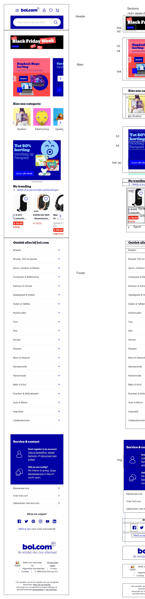
  
  
  ### dynamisch deel (bijv menu): 
  

  ### wellicht nog een dynamisch deel (bijv filter): 
  

## Voortgang 1 (week 2)

  
uitwerken voor 1e voortgang

  ### Stand van zaken
  ### Progress week 1
  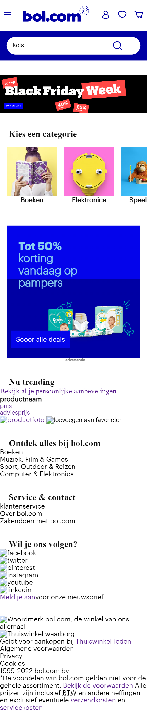
  
  hier dit ging goed & dit was lastig (neem ook screenshots op van delen van je website en code)
  Goed:
  1. Carousel maken
  2. html screenreader friendly maken
  3. met css de html elementen rangschikken zodat het visueel aantrekkelijker wordt (bv door middel van flexbox)
  
  ### 3. html elementen visueel omdraaien
   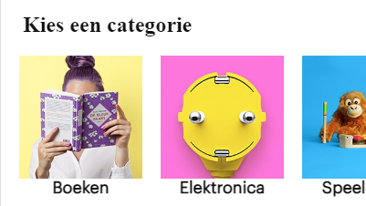
   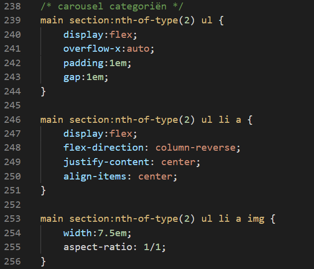

  ### Agenda voor meeting
  samen met je groepje opstellen

  | student 1 - Kim      | student 2 - Tim        | student 3 - Julia (ik)   | student 4 - Robin       |
  | ---            | ---                | ---          | ---              |
  | 1.Hoe maak ik de animatie van een hamburgermenu?  | 1. Hoe kan ik een functioneel schaakbord maken?           | 1. Hoe kan ik gebruikers door een carousel laten skippen d.m.v. buttons?    | en dan ik dat    |
  | 2. Hoe codeer ik een hamburgermenu? | 2. Hoe zorg ik ervoor dat mijn elements responsive blijven? | 2. Hoe kan ik m'n hamburgermenu full-screen tonen? Ja, display:block; , maar die class via JS toevoegen of anders?| dit wil ik zeker |
  |                | 3. Hoe geef ik de gebruiker een light-mode optie?                   |3. Met 3 css-style sheets, kan ik de variabele van kleuren in 1 sheet zetten en die dan in de andere twee sheets gebruiken?| |
  | ...            | ...                | ...          | ...              |

  ### Verslag van meeting
  hier na afloop snel de uitkomsten van de meeting vastleggen

 1. Bij een input veld (bijvoorbeeld de bol.com zoekbalk) hoort altijd een label. Deze maak je dan visueel onzichtbaar zodat de screenreader hem nog wel ziet.
 2. Bij de zoekbalk zit ook een button zodat de gebruiker na het typen zijn zoekopdracht kan zoeken. Die button moet het type "submit" hebben, omdat je je zoekopdracht submit naar de server
  3. Uitleg gekregen hoe een hamburger menu gemaakt kan worden.
  4. Als het bestand meerdere style sheets heeft, kan het ene style sheet variabele kleuren (e.d.) vanuit andere stylesheets halen.
  5. Scrollen op de main tijdens het openhebben van het menu kan voorkomen worden door overflowY:hidden op de main te zetten zodra het menu opent.

## Voortgang 2 (week 3)

  
uitwerken voor 2e voortgang

  ### Stand van zaken
  hier dit ging goed & dit was lastig (neem ook screenshots op van delen van je website en code)
   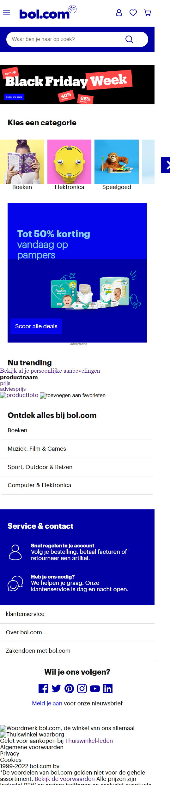
   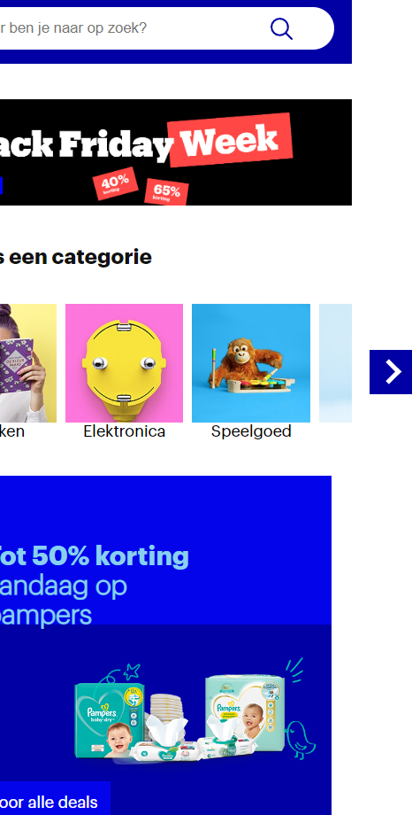
  
  Dit ging goed:
  1. Kopje "Service & Contact" stylen met grid

  ### Agenda voor meeting
  samen met je groepje opstellen

  | student 1 - Kim      | student 2 - Tim          | student 3 - Julia    | student 4        |
  | ---            | ---                | ---          | ---              |
  | Hoe bepaal ik mijn breakpoints van de website? Houd ik de origenele aan?  | Tim is oppermaster in code en heeft geen vragen             | 1. Erg leuk dat die pijltjes van mijn carousel buiten beeld staan, maar kunnen die ook zo gemaakt worden dat ik niet naar de zijkant kan scrollen?    | en dan ik dat    |
  | en dat ook nog | dit als er tijd is | 2. Voor mijn productpagina heb ik een tabel nodig. Kan ik ergens een juiste HTML-structuur hiervoor vinden? | dit wil ik zeker |
  | ...            | ...                | ...          | ...              |

note: Punt 1 is al voor de meeting opgelost met overflow-X:hidden;

  ### Verslag van meeting
  hier na afloop snel de uitkomsten van de meeting vastleggen

  - Structuur van een tabel kan je op MDN vinden

## Toegankelijkheidstest 2/2 (week 4)

  
uitwerken na test in 8e werkgroep

  ### Bevindingen
  Lijst met je bevindingen die in de test naar voren kwamen (geef ook aan wat er verbeterd is):

  #### Screenreader
  Hier korte omschrijving (met indien nodig afbeeldingen)
  1. Als de gebruiker het menu opent, zegt de aria-label op de sluitbutton "open menu"
  2. Voor de rest is de code screenreader vriendelijk en kan de gebruiker langs alle kopjes en linkjes skippen.
  3. Goed dat het verborgen menu geskipt wordt en dat de tabtoets niet verdwijnt in het menu
  4. Netjes aria-labels toegepast op punten waar het nodig is

  

  Hier een omschrijving van hoe het opgelost kan worden
  1. Aria-label tekst aanpassen naar "sluit menu"

  #### Muis en Toetsenbord 
  Hier korte omschrijving (met indien nodig afbeeldingen)
  1. Met tabben kan de gebruiker niet zien waar hij is in de caroussel van categoriën
  2. Voor de rest kan de gebruiker met muis en toetsenbord overal op de site komen en krijgt hij feedback in de verschillende states.

  Hier een omschrijving van hoe het opgelost kan worden
  1. Focus state toevoegen aan carouselitems

  #### Motoriek (shocks, elastiekjes)
  Hier korte omschrijving (met indien nodig afbeeldingen)
  1. De app is goed te bedienen doordat de knoppen een redelijke grootte hebben. Met parkinson schiet de gebruiker af en toe nog wat uit en kan hij misklikken.
  2. Vergeleken met de originele site is deze gebruiksvriendelijker door de grotere knoppen em de grotere tekst

  Hier een omschrijving van hoe het opgelost kan worden
  1. Een modus maken waar de buttons groter zijn zodat de gebruiker minder snel misklikt

  #### Visueel (brillen, contrast, kleurenblind, dark/light). 
  Hier korte omschrijving (met indien nodig afbeeldingen)
  1. Bij blurred vision is sommige tekst lastig te lezen omdat het font dun is
  2. Met de andere visuele beperkingen zoals kleurenblindheid is de site nogsteeds goed leesbaar en is het contrast voldoende
  3. Als de gebruiker inzoomt op de browser (ctrl +) schaalt de content goed mee, dus gebruikers die hier behoefte aan hebben kunnen ook zelf de site vergroten door in te zoomen.

   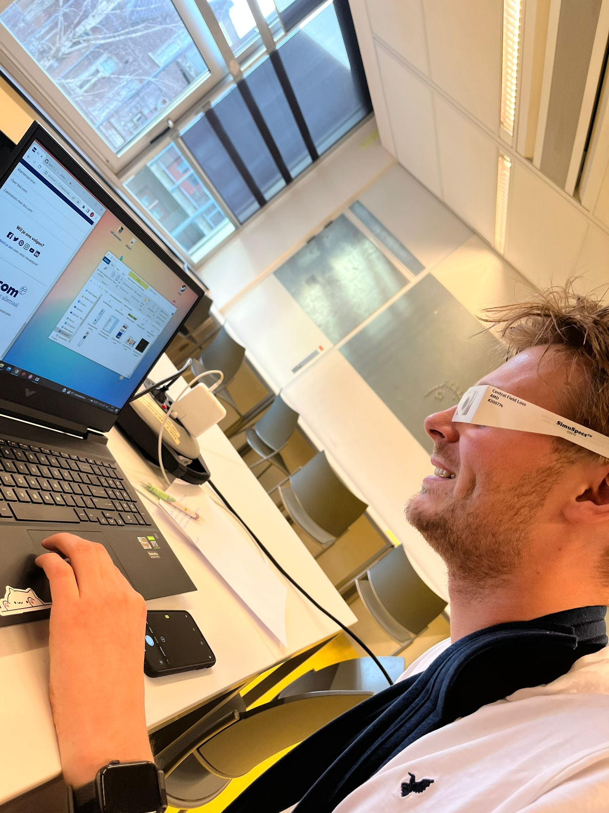

  Hier een omschrijving van hoe het opgelost kan worden (met indien nodig afbeeldingen)
  1. Dikke modus toevoegen met grote letters en zwaardere fonts (als ik tijd heb)

## Voortgang 3 (week 4)

  
uitwerken voor 3e voortgang

  ### Stand van zaken
  hier dit ging goed & dit was lastig (neem ook screenshots op van delen van je website en code)
  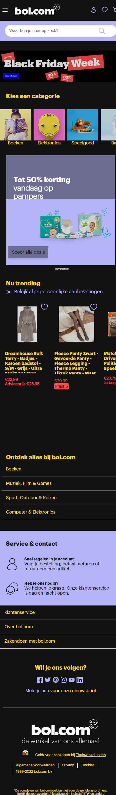

  ### Agenda voor meeting
  samen met je groepje opstellen

  | student 1 - Kim     | student 2 - Julia         | student 3 - Tim   | student 4        |
  | ---            | ---                | ---          | ---              |
  | De javascript koppeling werkte niet, wat doe ik fout?  | Geen vragen             | Mag ik de stappen van mn schaakstukken opslaan in eigen gemaakte html class?    | en dan ik dat    |
  | en dat ook nog | dit als er tijd is | nog een punt | dit wil ik zeker |
  | ...            | ...                | ...          | ...              |

  ### Verslag van meeting
  hier na afloop snel de uitkomsten van de meeting vastleggen

  - punt 1 - Bij de Java koppeling moet "defer" staan zodat de javascript nagelopen wordt nadat de html is ingeladen.
  - punt 2 - Het contrast bij bol.com bij de donkere modus was niet overal even goed. Dit kan gecontroleerd worden door te inspecteren. Het contrast moet hoger zijn dan 4,5
  - punt 3 - Variabele opslaan is het netste als je dit gewoon in een javascript variabele doet en niet in de html class.
  - ...

## Eindgesprek (week 5)

  
uitwerken voor eindgesprek

  ### Je uitkomst - karakteristiek screenshots:
  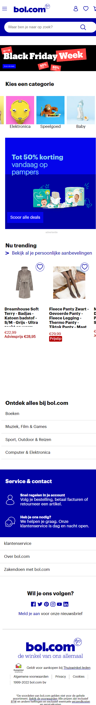
  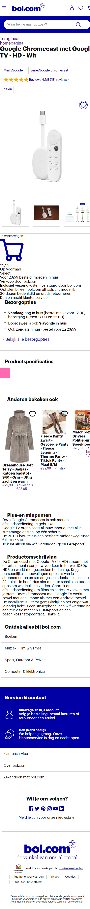
  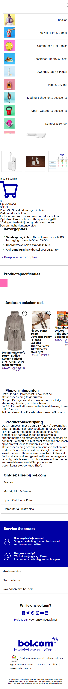

  ### Dit ging goed/Heb ik geleerd: 
  Korte omschrijving met plaatjes
  1. Zorgen dat met tabben de gebruiker alleen door de navigatie kan als het opengeklapt is met "inset" attribute
  2. Zorgen dat de gebruiker niet over de main kan scrollen als het menu open is met overflow-Y:hidden op de main
  3. Structuur van een tabel en deze eenvoudig stylen
  4. Werken met grid
  5. Werken met positioning
  6. Javascript een imagesource van een html element laten opslaan
  
  ### Dit is wat ik denk wat ik al gedaan heb voor de surface plane:
  1. Animaties met keyframes gebruikt
  2. Darkmode toegevoegd en gecontroleerd of het contrast hoog genoeg is (surface plane)
  3. DOM-manipulatie door de image src aan te passen bij productpagina (surface plane)
  4. Scroll animaties? Heb snap gebruikt in de categoriën carousel op de homepagina (surface plane)
  4. Advanced positioning? z-index gebruikt (surface plane)

  ### Dit is wat ik denk wat ik nog moet doen:
  1. Styling van de productpagina afmaken
  2. Animatie toevoegen als de gebruiker een item toevoegd aan zijn winkelwagen/wishlist (surface plane)
  3. Modus toevoegen met extra dikke/grotere letters voor gebruikers die daar behoefte aan hebben (surface plane)

  ### Dit was lastig/Is niet gelukt:
  1. hover/tab styling is lelijk en voelt niet aan als een echte website

  

## Bronnenlijst

  
continu bijhouden terwijl je werkt

  Nb. Wees specifiek ('css-tricks' als bron is bijv. niet specifiek genoeg).

  1. voor de ster-shape van reviews https://www.coding-dude.com/wp/css/css-star/
  2. Bol.com was mn bae voor alle afbeeldingen en svg's
  3. ...

